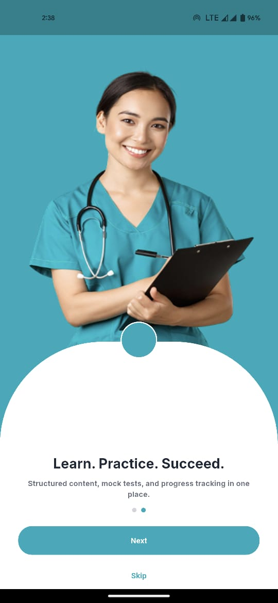
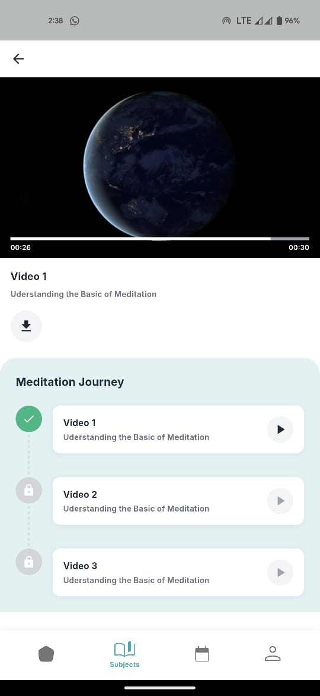
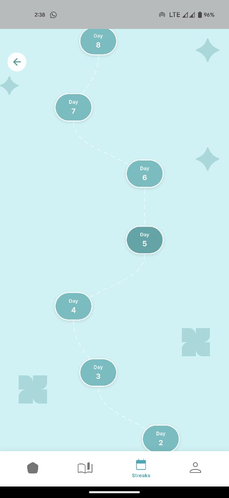
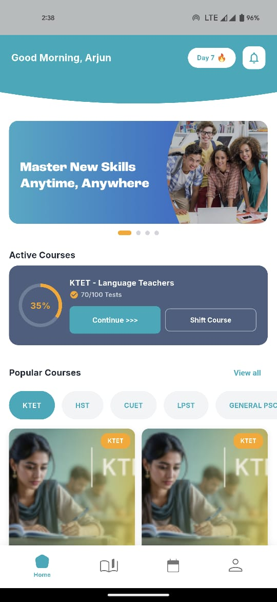

# Tutor App

tutor_app is a comprehensive educational platform built with Flutter, designed to provide students with a structured and engaging learning experience. From tracking daily streaks to watching in-depth video lectures, current application offers a seamless interface for academic progress.

## 🚀 Features

- **Interactive Streaks**: Gamified daily progress tracking with a beautiful, winding path UI.
- **Video Learning**: Integrated video player supporting lectures with playback controls.
- **Subject Modules**: Organized content delivery for various subjects and topics.
- **Smart Navigation**: Smooth transitions and clear navigation flow.
- **Platform Ready**: Configured for both Android and iOS (including HTTP video support).

## 🛠 Tech Stack

- **Framework**: [Flutter](https://flutter.dev)
- **Language**: [Dart](https://dart.dev)
- **State Management**: [GetX](https://pub.dev/packages/get)
- **Architecture**: Clean Architecture (Data/Domain/Presentation separation)
- **Video Player**: `video_player` plugin customized for education.

## 📸 Functionality Overview

### App Screenshots

<p float="left">
  
   
  
  
  
</p>

### ▶️ Demo

[**Watch the App Walkthrough (MP4)**](sr1.mp4)

## 🔧 Getting Started

1. **Clone the repository**
   ```bash
   git clone https://github.com/yourusername/tutor_app.git
   ```

2. **Install dependencies**
   ```bash
   flutter pub get
   ```

3. **Run the app**
   ```bash
   flutter run
   ```
   *Note: Ensure you have an emulator running or a physical device connected.*

